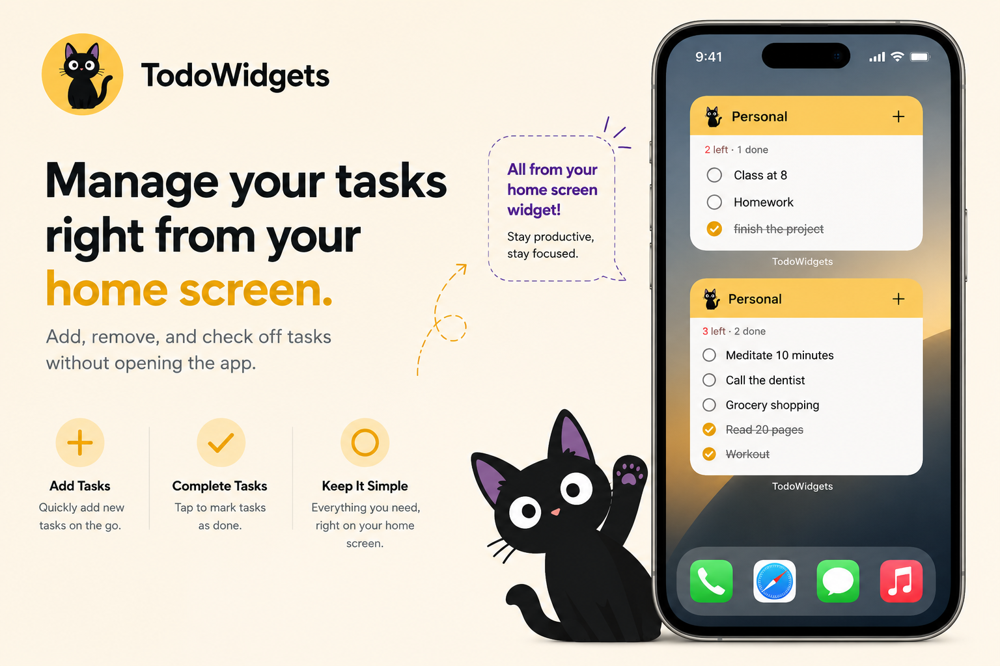

<div align="center">


# TodoWidget

**A to-do list you run from your home screen.**

Add, tick and delete — without ever opening the app.


<br />

<a href="https://drive.google.com/file/d/145odBPue3BfFwgNlh3YM-xRWK604xYOK/view?usp=sharing">
  
</a>

</div>

---

## Why I built this

I kept installing to-do apps and kept uninstalling them for the same three reasons.


- **You have to go inside the app to do anything.** The widget is a read-only poster. Add something? Open the app. Cross one off? Open the app. Delete it? Open the app.
- **Ads.** A banner inside a to-do list, and an interstitial between me and the thing I was about to write down.
- **Too many features.** Projects, labels, priorities, sub-tasks, streaks, collaboration. I wanted a list. I got a project management suite.

**TodoWidget is the opposite of all three.** The widget **is** the app. No ads — and no `INTERNET` permission to serve them with. The feature list stops where a to-do list is finished.

---

## Everything happens on the widget



| Action | How |
| --- | --- |
| **Add** | Tap `+`. A sheet opens over the home screen, keyboard up. The app never appears. |
| **Complete** | Tap the row. |
| **Delete** | Tap the bin, then confirm — two deliberate taps. |
| **Scroll** | Every size scrolls, down to the 2 × 2. Nothing is stranded off the bottom. |
| **Show / clear** completed | Eye and broom in the footer. |
| **Switch list** | Tap the swap icon. |


---

## Simple by design


- **One screen.** Lists are chips on top, tasks are cards below.
- **Type and send.** The input sits at the bottom, always in reach.
- **Multiple lists**, each with its own colour.
- **Drag to reorder**, **undo** any delete.
- **Light / Dark / System**, in the ⋮ menu.
- No accounts, no onboarding, no sync setup.

---

## Widget sizes

Four in the picker — but the layout follows the **measured** size, so resizing genuinely upgrades a
widget instead of stretching it. **All four scroll.**

| Size | Cells | What you get |
| --- | --- | --- |
| **Small** | 2 × 2 | What's next, at a glance. |
| **Medium** | 4 × 2 | A few tasks, delete on each row. |
| **Large** | 4 × 4 | Show/hide completed, clear completed, switch list. |
| **Extra large** | 5 × 5 | Roomier rows and a progress bar. |

Each widget's header takes its list's colour, so two side by side are tellable apart before either
is read.

---

## Privacy

No account, no analytics, no sync. Tasks live in one JSON file in app-private storage and never
leave the device.

**The app does not request `INTERNET`** — it could not phone home if it wanted to. The only
permission written by app code is `RECEIVE_BOOT_COMPLETED`, so widgets survive a restart. The rest
(`WAKE_LOCK`, `ACCESS_NETWORK_STATE`, `FOREGROUND_SERVICE`) come from WorkManager, pulled in
transitively by Glance.

---

## Tech

**Kotlin** · **Jetpack Compose** + Material 3 · **Glance** for the widgets · **DataStore** with a
JSON codec · min SDK 26, target 36 · R8 with resource shrinking.

One source of truth: the app, the quick-add sheet and every widget read the same DataStore. Writes
are atomic read-modify-write, so two widgets tapping the same list cannot lose an update.

```
app/src/main/java/com/simpletodo/
├── data/      models, JSON, DataStore, repository
├── ui/        home screen, dialogs, view model, theme
├── quickadd/  the translucent "+" sheet
└── widget/    Glance widgets, actions, sizing, config
```

---

## Build

```bash
./gradlew assembleRelease   # APK
./gradlew bundleRelease     # AAB
```

Signing is picked up from a `keystore.properties` in the project root; without one the release
build still configures and comes out unsigned.

> **R8 note:** Glance routes every widget render through a WorkManager job, and WorkManager
> instantiates its collaborators reflectively. `app/proguard-rules.pro` keeps the constructors it
> needs — without them the build compiles and every widget sits on a loading spinner forever.
> Test widget changes on a **minified release** build, not debug.

---

Published on Google Play as `com.auvro.todowidget`. No licence chosen yet, so default copyright
applies.
