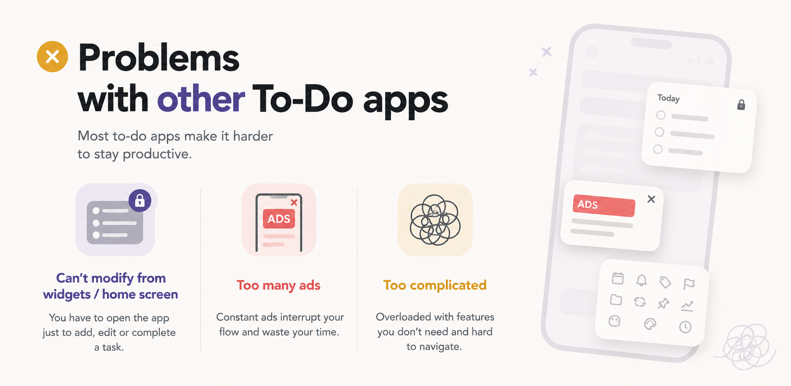
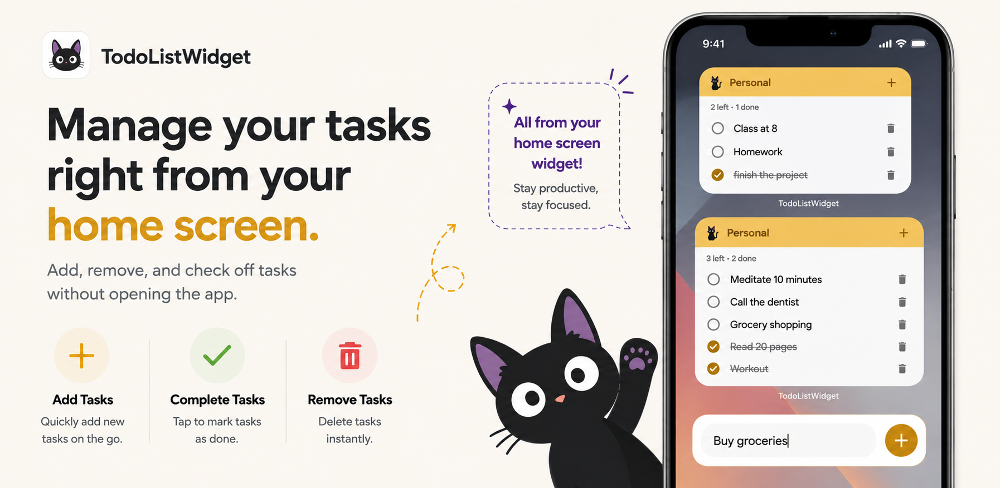
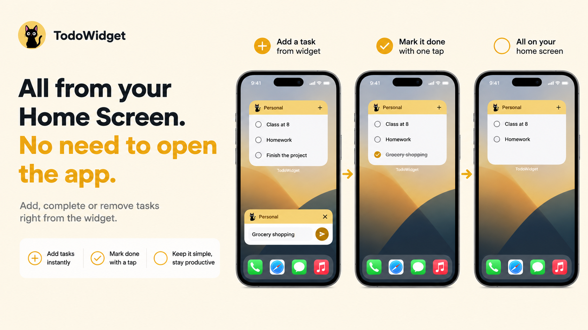
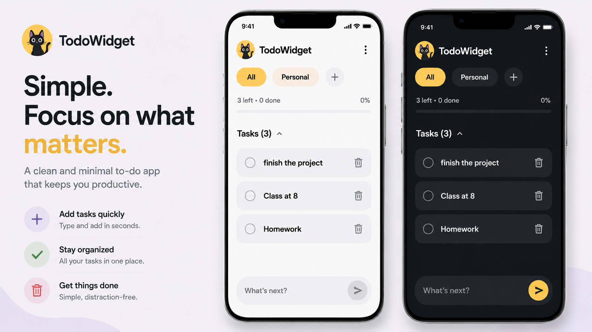

<div align="center">


# TodoWidget

**A to-do list you actually run from your home screen.**

Add a task, tick it off, delete it — without ever opening the app.

-3DDC84?logo=android&logoColor=white)


<br />

<a href="https://drive.google.com/file/d/1HUqEe2dcPV2Oe4R6dddZWDCJS36gNqV6/view?usp=sharing">
  
</a>

</div>

---

## Why I built this

I kept installing to-do apps and kept uninstalling them for the same three reasons.



**You have to go *inside* the app to do anything.** The widget is a read-only poster. Want to add
something? Open the app. Cross one off? Open the app. Delete it? Open the app. Every one of those is
a context switch for an action that should take one tap on the home screen.

**Ads.** A to-do list is one of the smallest, simplest things software can do, and somehow there is a
banner in it, and an interstitial between me and the thing I was about to write down.

**Too many features.** Projects, labels, priorities, sub-tasks, karma streaks, natural-language
parsing, collaboration. I wanted a list. I got a project management suite with a learning curve.

TodoWidget is the opposite of all three. The widget *is* the app. There are no ads, and there is no
`INTERNET` permission to serve them with. And the feature list stops at the point where a to-do list
is finished.

---

## Everything happens on the home screen



The widget is fully interactive — not a preview of the app, but the app itself:

| Action | How |
| --- | --- |
| **Add** a task | Tap `+` on the widget. A small sheet opens over the home screen with the keyboard already up — the full app never appears. |
| **Complete** a task | Tap its circle. It strikes through and stays put, so the tap has visible feedback and a mistake is one tap to undo. |
| **Delete** a task | Tap the bin, then confirm. Two deliberate taps, with the confirm control on the opposite side of the row, so a fat-finger costs nothing. |
| **Hide / show** completed | Tap the eye in the footer. |
| **Clear** completed | Tap the broom. |
| **Switch list** | Tap the swap icon to point the widget at a different list. |



---

## Simple by design



The whole app is one screen. Lists are chips across the top, their tasks are cards below. There is
deliberately no separate "lists" screen — switching lists is a single tap, because that is the
operation the app is built around.

- **Multiple lists**, each with its own colour from a six-tone palette
- **Type and send** — the input sits at the bottom like a chat box, always in reach
- **Drag to reorder** the active tasks
- **Undo** for a deleted task or a deleted list
- **Light / Dark / System** theme, in the ⋮ menu
- No accounts, no onboarding, no sync setup

---

## Widget sizes

Four sizes are offered in the picker, but the layout is chosen from the widget's **measured** size,
not the one you picked — so stretching a small widget across the screen genuinely upgrades it rather
than scaling it up.

| Size | Cells | What you get |
| --- | --- | --- |
| **Small** | 2 × 2 | What's next, at a glance. Tick tasks, quick add. |
| **Medium** | 4 × 2 | A few tasks, with a delete control on each row. |
| **Large** | 4 × 4 | Scrollable list, show/hide completed, clear completed, switch list. |
| **Extra large** | 5 × 5 | The whole list, roomier rows and a progress bar. |

The widget's header band takes the colour of the list it shows, so two widgets side by side are
tellable apart before either one is read.

---

## Privacy

There is no account, no analytics, no crash reporting and no sync. Your tasks are a single JSON file
in the app's private storage (`files/datastore/todo_store_v1.json`) and never leave the device.

The clearest way to state it: **the app does not request the `INTERNET` permission**, so it could not
phone home even if it wanted to. Here is the complete permission list from the merged release
manifest:

| Permission | Where it comes from |
| --- | --- |
| `RECEIVE_BOOT_COMPLETED` | Ours — so widgets come back after a restart. |
| `WAKE_LOCK`, `ACCESS_NETWORK_STATE`, `FOREGROUND_SERVICE` | WorkManager, pulled in transitively by Glance. Not used by app code. |
| `DYNAMIC_RECEIVER_NOT_EXPORTED_PERMISSION` | A self-scoped permission the AndroidX libraries declare for their own receivers. |

---

## Tech

| | |
| --- | --- |
| **Language** | Kotlin 2.3.21 |
| **App UI** | Jetpack Compose, Material 3 (Compose BOM 2026.08.00) |
| **Widgets** | Glance for App Widgets 1.2.0 |
| **Storage** | DataStore, with a hand-written JSON serializer over `org.json` |
| **Min / Target SDK** | 26 (Android 8.0) / 36 |
| **Build** | AGP 9.3.1, R8 with resource shrinking |

**One source of truth.** The app UI, the quick-add sheet and every widget instance all read the same
`DataStore`. Every mutation is a read-modify-write inside `updateData`, which is atomic and
serialised, so rapid taps from two widgets showing the same list cannot interleave into a lost
update. Writes push an update to all widgets, coalesced so a burst of edits becomes one refresh.

**Widgets tick from a flow.** Each widget collects the snapshot inside its own composition, so a tap
on the widget re-renders it immediately rather than waiting for a round trip through the update
worker.

### Project layout

```
app/src/main/java/com/simpletodo/
├── data/          Models, JSON codec, DataStore, repository, theme preference
├── ui/            Compose app: home screen, dialogs, view model, theme
├── quickadd/      The translucent "+" sheet the widget opens
├── widget/        Glance widgets, receivers, action callbacks, sizing, config
├── AppGraph.kt    Process-wide singletons, built lazily from any Context
└── TodoApplication.kt
```

The Kotlin package (`com.simpletodo`) is deliberately not the same as the application id
(`com.auvro.todowidget`): the id is the app's permanent Play identity, the package is just where the
source lives.

---

## Download

**[⬇ Download the APK](https://drive.google.com/file/d/1HUqEe2dcPV2Oe4R6dddZWDCJS36gNqV6/view?usp=sharing)** — Android 8.0 (API 26) or newer.

Because this is a direct APK rather than a store install, Android will ask you to allow installs
from whichever app you download it with (Chrome, Files, Drive). That prompt is Android's, not the
app's — TodoWidget itself asks for no permission at install time beyond the ones listed above.

Prefer to build from source? See below.

---

## Build it yourself

```bash
git clone https://github.com/AuvroIslam/ToDoWidgets.git
cd ToDoWidgets

./gradlew assembleDebug        # debug APK
./gradlew assembleRelease      # minified release APK
./gradlew bundleRelease        # AAB for Play
```

Outputs land in `app/build/outputs/`.

Release builds are signed if a `keystore.properties` exists in the project root:

```properties
storeFile=/absolute/path/to/upload.jks
storePassword=...
keyAlias=upload
keyPassword=...
```

Without it the release build still configures and simply comes out unsigned, so a contributor with
no key can still build.

> **Note on R8:** Glance routes every widget render through a WorkManager job, and WorkManager
> instantiates its collaborators reflectively. The rules in `app/proguard-rules.pro` keep the
> constructors it needs — without them the release build compiles fine and then every widget sits on
> a loading spinner forever. Verify widget changes against a **minified release** build, not just
> debug.

---

## Status

Published on Google Play as `com.auvro.todowidget`.

No licence has been chosen for this repository yet, so default copyright applies.
