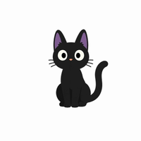

  

# TodoWidget — Privacy Policy

**Effective date:** August 25, 2026

TodoWidget ("the app") is a home-screen to-do list widget for Android. This policy explains what data the app handles. The short version: **TodoWidget does not collect, transmit, or share any personal data.**

## Data the app stores

- **Your to-do items.** Tasks you create are stored only on your device, in the app's local storage. They never leave your device.
- **App settings.** Preferences (such as widget appearance) are stored only on your device.

## What the app does NOT do

- No internet access. The app declares no network permission, so it cannot send data anywhere.
- No accounts, no sign-in, no analytics, no advertising, no tracking.
- No third-party SDKs that collect data.

## Permissions

- **RECEIVE_BOOT_COMPLETED** — used only to refresh your widgets after the device restarts. No data is transmitted.

## Data removal

Uninstalling the app permanently deletes all tasks and settings stored on your device.

## Changes

If this policy ever changes, the updated version will be published on this page with a new effective date.

## Contact

Questions about this policy? Open an issue on the [GitHub repository](https://github.com/AuvroIslam/TodoListWidget) or contact: **auvroislam@gmail.com**
